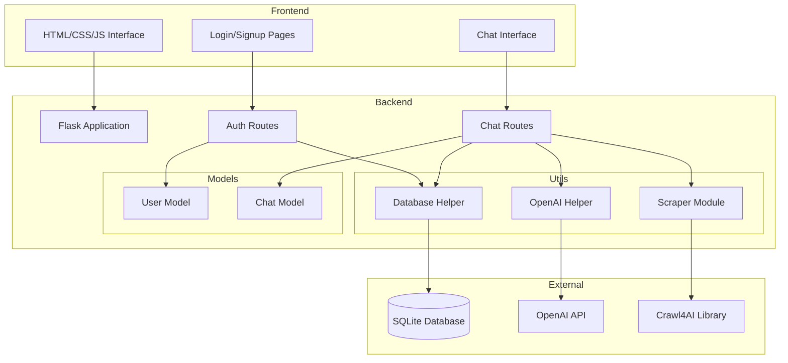

# Design Document

## Overview

The Web Scraping Chatbot is a full-stack application that combines web scraping capabilities with conversational AI. The system uses a three-tier architecture: a lightweight frontend built with vanilla HTML/CSS/JavaScript, a Python backend using Flask, and SQLite for data persistence. The application integrates Crawl4AI for intelligent web crawling and OpenAI's GPT-4 for natural language understanding and response generation.

### Key Design Principles

- **Simplicity**: Minimal dependencies, clean code structure, no unnecessary frameworks
- **Modularity**: Clear separation of concerns between authentication, scraping, AI processing, and data storage
- **Security**: Secure password hashing, session management, input validation, and environment-based configuration
- **User Experience**: Responsive, professional interface with smooth interactions and clear feedback

## Architecture

### System Architecture Diagram



### Technology Stack

**Frontend:**
- HTML5 for structure
- CSS3 for styling (no frameworks, custom responsive design)
- Vanilla JavaScript for interactivity and API communication

**Backend:**
- Python 3.9+
- Flask 3.0+ (lightweight web framework)
- Flask-CORS for cross-origin requests
- python-dotenv for environment variable management

**Data & Storage:**
- SQLite3 for relational data storage
- File-based database (database.db)

**Web Scraping:**
- Crawl4AI for intelligent web crawling
- BeautifulSoup4 as fallback parser if needed

**AI Processing:**
- OpenAI Python SDK (openai>=1.0.0)
- GPT-4 Turbo model

**Security:**
- bcrypt for password hashing
- JWT (PyJWT) for session token management
- Werkzeug security utilities

## Components and Interfaces

### Frontend Components

#### 1. Authentication Pages (login.html, signup.html)

**Purpose**: Handle user registration and login

**Key Elements:**
- Form inputs for email, username (signup only), and password
- Submit buttons with loading states
- Error message display areas
- Links to switch between login/signup

**JavaScript Functions:**
```javascript
// signup.html
async function handleSignup(email, username, password)
async function validateSignupForm(email, username, password)

// login.html
async function handleLogin(email, password)
async function validateLoginForm(email, password)
```

**API Integration:**
- POST /api/auth/register
- POST /api/auth/login

#### 2. Chat Interface (index.html)

**Purpose**: Main application interface for chatbot interaction

**Layout Structure:**
- Top navbar: User info, logout button
- Left sidebar: Chat history list, "New Chat" button (collapsible)
- Main area: Chat messages display, input section
- Input section: URL input, prompt textarea, send button

**Key JavaScript Modules:**

```javascript
// Chat Management
class ChatManager {
    constructor()
    async sendMessage(url, prompt)
    async loadChatHistory()
    async loadChat(chatId)
    async createNewChat()
    displayMessage(message, isUser)
    showLoading()
    hideLoading()
}

// API Client
class APIClient {
    constructor(baseURL)
    async post(endpoint, data)
    async get(endpoint)
    setAuthToken(token)
}

// UI Controller
class UIController {
    constructor()
    toggleSidebar()
    scrollToBottom()
    updateChatList(chats)
    showError(message)
}
```

**CSS Architecture:**
- Variables for colors, spacing, and typography
- Flexbox for layout
- CSS Grid for chat message alignment
- Media queries for responsive design (mobile-first approach)

### Backend Components

#### 1. Application Entry Point (app.py)

**Purpose**: Initialize Flask application and configure middleware

```python
from flask import Flask
from flask_cors import CORS
from dotenv import load_dotenv
import os

def create_app():
    app = Flask(__name__)
    
    # Load environment variables
    load_dotenv()
    
    # Configuration
    app.config['SECRET_KEY'] = os.getenv('SECRET_KEY')
    app.config['DATABASE'] = 'database.db'
    
    # Enable CORS
    CORS(app)
    
    # Register blueprints
    from routes.auth import auth_bp
    from routes.chat import chat_bp
    
    app.register_blueprint(auth_bp, url_prefix='/api/auth')
    app.register_blueprint(chat_bp, url_prefix='/api/chat')
    
    # Initialize database
    from utils.db import init_db
    with app.app_context():
        init_db()
    
    return app
```

#### 2. Authentication Routes (routes/auth.py)

**Purpose**: Handle user registration, login, and session management

**Endpoints:**

```python
# POST /api/auth/register
@auth_bp.route('/register', methods=['POST'])
def register():
    """
    Request Body: {email, username, password}
    Response: {success: bool, message: str}
    
    Process:
    1. Validate input data
    2. Check if email exists
    3. Hash password with bcrypt
    4. Insert user into database
    5. Return success response
    """

# POST /api/auth/login
@auth_bp.route('/login', methods=['POST'])
def login():
    """
    Request Body: {email, password}
    Response: {success: bool, token: str, user: {id, email, username}}
    
    Process:
    1. Validate input data
    2. Retrieve user from database
    3. Verify password with bcrypt
    4. Generate JWT token
    5. Return token and user info
    """

# POST /api/auth/logout
@auth_bp.route('/logout', methods=['POST'])
@require_auth
def logout():
    """
    Headers: Authorization: Bearer <token>
    Response: {success: bool}
    
    Process:
    1. Validate token
    2. Add token to blacklist (optional)
    3. Return success response
    """
```

**Helper Functions:**
```python
def hash_password(password: str) -> str
def verify_password(password: str, hashed: str) -> bool
def generate_token(user_id: int) -> str
def verify_token(token: str) -> dict
def require_auth(f): # Decorator for protected routes
```

#### 3. Chat Routes (routes/chat.py)

**Purpose**: Handle chat interactions, web scraping, and AI processing

**Endpoints:**

```python
# POST /api/chat/message
@chat_bp.route('/message', methods=['POST'])
@require_auth
def send_message():
    """
    Request Body: {chat_id: str|null, url: str|null, prompt: str}
    Response: {success: bool, response: str, chat_id: str}
    
    Process:
    1. Validate authentication
    2. Get or create chat session
    3. If URL provided, scrape website
    4. Send prompt + content to OpenAI
    5. Save user message and AI response
    6. Return AI response
    """

# GET /api/chat/history
@chat_bp.route('/history', methods=['GET'])
@require_auth
def get_history():
    """
    Response: {chats: [{chat_id, timestamp, preview}]}
    
    Process:
    1. Validate authentication
    2. Retrieve all chat sessions for user
    3. Return list with metadata
    """

# GET /api/chat/<chat_id>
@chat_bp.route('/<chat_id>', methods=['GET'])
@require_auth
def get_chat(chat_id):
    """
    Response: {chat_id, messages: [{role, content, timestamp}]}
    
    Process:
    1. Validate authentication and ownership
    2. Retrieve all messages for chat
    3. Return complete conversation
    """

# POST /api/chat/new
@chat_bp.route('/new', methods=['POST'])
@require_auth
def new_chat():
    """
    Response: {chat_id: str}
    
    Process:
    1. Validate authentication
    2. Create new chat session
    3. Return new chat_id
    """
```

#### 4. Scraper Module (utils/scraper.py)

**Purpose**: Web crawling and content extraction using Crawl4AI

```python
from crawl4ai import WebCrawler
from crawl4ai.extraction_strategy import LLMExtractionStrategy
import asyncio

class WebScraper:
    def __init__(self):
        self.crawler = WebCrawler()
    
    async def scrape_url(self, url: str) -> dict:
        """
        Scrape website and extract text content
        
        Args:
            url: Target website URL
            
        Returns:
            {
                'success': bool,
                'content': str,
                'title': str,
                'error': str|None
            }
        """
        try:
            # Run crawler
            result = await self.crawler.arun(url=url)
            
            if result.success:
                return {
                    'success': True,
                    'content': result.markdown,  # Clean markdown content
                    'title': result.title,
                    'error': None
                }
            else:
                return {
                    'success': False,
                    'content': '',
                    'title': '',
                    'error': result.error_message
                }
                
        except Exception as e:
            return {
                'success': False,
                'content': '',
                'title': '',
                'error': str(e)
            }
    
    def scrape_sync(self, url: str) -> dict:
        """Synchronous wrapper for async scrape_url"""
        return asyncio.run(self.scrape_url(url))
```

**Design Decisions:**
- Use Crawl4AI's markdown extraction for clean, structured content
- Implement async/await pattern for efficient I/O operations
- Provide synchronous wrapper for Flask route compatibility
- Return structured dict with success status and error handling

#### 5. OpenAI Helper (utils/openai_helper.py)

**Purpose**: Interface with OpenAI API for natural language processing

```python
from openai import OpenAI
import os

class OpenAIHelper:
    def __init__(self):
        self.client = OpenAI(api_key=os.getenv('OPENAI_API_KEY'))
        self.model = "gpt-4-turbo-preview"
        self.temperature = 0.7
        
        self.system_prompt = """You are a web scraping assistant. You analyze website content and extract only the information the user requests. 

Your responses should be:
- Clear and human-readable (no JSON, XML, or raw data)
- Focused on the specific information requested
- Well-organized with proper formatting
- Concise but complete

If the user asks for specific data points (like prices, names, dates), present them in a clean, readable format."""
    
    def generate_response(self, user_prompt: str, website_content: str = None, 
                         conversation_history: list = None) -> dict:
        """
        Generate AI response based on user prompt and context
        
        Args:
            user_prompt: User's question or request
            website_content: Scraped website content (optional)
            conversation_history: Previous messages for context (optional)
            
        Returns:
            {
                'success': bool,
                'response': str,
                'error': str|None
            }
        """
        try:
            messages = [{"role": "system", "content": self.system_prompt}]
            
            # Add conversation history
            if conversation_history:
                messages.extend(conversation_history)
            
            # Build user message
            user_message = user_prompt
            if website_content:
                user_message = f"Website Content:\n\n{website_content}\n\nUser Request: {user_prompt}"
            
            messages.append({"role": "user", "content": user_message})
            
            # Call OpenAI API
            response = self.client.chat.completions.create(
                model=self.model,
                messages=messages,
                temperature=self.temperature,
                max_tokens=2000
            )
            
            return {
                'success': True,
                'response': response.choices[0].message.content,
                'error': None
            }
            
        except Exception as e:
            return {
                'success': False,
                'response': '',
                'error': str(e)
            }
```

**Design Decisions:**
- Maintain conversation context by accepting message history
- Combine website content with user prompt for context
- Use structured system prompt for consistent behavior
- Handle errors gracefully with detailed error messages
- Use GPT-4 Turbo for best performance

#### 6. Database Helper (utils/db.py)

**Purpose**: Database operations and schema management

```python
import sqlite3
from datetime import datetime
import uuid

DATABASE = 'database.db'

def get_db():
    """Get database connection"""
    conn = sqlite3.connect(DATABASE)
    conn.row_factory = sqlite3.Row
    return conn

def init_db():
    """Initialize database schema"""
    conn = get_db()
    cursor = conn.cursor()
    
    # Users table
    cursor.execute('''
        CREATE TABLE IF NOT EXISTS users (
            id INTEGER PRIMARY KEY AUTOINCREMENT,
            email TEXT UNIQUE NOT NULL,
            username TEXT NOT NULL,
            password_hash TEXT NOT NULL,
            created_at TIMESTAMP DEFAULT CURRENT_TIMESTAMP
        )
    ''')
    
    # Chats table
    cursor.execute('''
        CREATE TABLE IF NOT EXISTS chats (
            id TEXT PRIMARY KEY,
            user_id INTEGER NOT NULL,
            created_at TIMESTAMP DEFAULT CURRENT_TIMESTAMP,
            updated_at TIMESTAMP DEFAULT CURRENT_TIMESTAMP,
            FOREIGN KEY (user_id) REFERENCES users(id)
        )
    ''')
    
    # Messages table
    cursor.execute('''
        CREATE TABLE IF NOT EXISTS messages (
            id INTEGER PRIMARY KEY AUTOINCREMENT,
            chat_id TEXT NOT NULL,
            role TEXT NOT NULL,
            content TEXT NOT NULL,
            timestamp TIMESTAMP DEFAULT CURRENT_TIMESTAMP,
            FOREIGN KEY (chat_id) REFERENCES chats(id)
        )
    ''')
    
    # Chat metadata table (for storing scraped URLs per chat)
    cursor.execute('''
        CREATE TABLE IF NOT EXISTS chat_metadata (
            chat_id TEXT PRIMARY KEY,
            last_url TEXT,
            last_scraped_content TEXT,
            FOREIGN KEY (chat_id) REFERENCES chats(id)
        )
    ''')
    
    conn.commit()
    conn.close()

# User operations
def create_user(email: str, username: str, password_hash: str) -> int
def get_user_by_email(email: str) -> dict
def get_user_by_id(user_id: int) -> dict

# Chat operations
def create_chat(user_id: int) -> str
def get_user_chats(user_id: int) -> list
def get_chat_messages(chat_id: str) -> list
def add_message(chat_id: str, role: str, content: str) -> None
def update_chat_timestamp(chat_id: str) -> None

# Chat metadata operations
def save_chat_metadata(chat_id: str, url: str, content: str) -> None
def get_chat_metadata(chat_id: str) -> dict
```

## Data Models

### User Model (models/user.py)

```python
from dataclasses import dataclass
from datetime import datetime

@dataclass
class User:
    id: int
    email: str
    username: str
    password_hash: str
    created_at: datetime
    
    def to_dict(self) -> dict:
        """Convert to dictionary (exclude password_hash)"""
        return {
            'id': self.id,
            'email': self.email,
            'username': self.username,
            'created_at': self.created_at.isoformat()
        }
    
    @staticmethod
    def from_db_row(row) -> 'User':
        """Create User from database row"""
        return User(
            id=row['id'],
            email=row['email'],
            username=row['username'],
            password_hash=row['password_hash'],
            created_at=datetime.fromisoformat(row['created_at'])
        )
```

### Chat Model (models/chat.py)

```python
from dataclasses import dataclass
from datetime import datetime
from typing import List

@dataclass
class Message:
    id: int
    chat_id: str
    role: str  # 'user' or 'assistant'
    content: str
    timestamp: datetime
    
    def to_dict(self) -> dict:
        return {
            'id': self.id,
            'chat_id': self.chat_id,
            'role': self.role,
            'content': self.content,
            'timestamp': self.timestamp.isoformat()
        }

@dataclass
class Chat:
    id: str
    user_id: int
    created_at: datetime
    updated_at: datetime
    messages: List[Message] = None
    
    def to_dict(self) -> dict:
        result = {
            'id': self.id,
            'user_id': self.user_id,
            'created_at': self.created_at.isoformat(),
            'updated_at': self.updated_at.isoformat()
        }
        
        if self.messages:
            result['messages'] = [msg.to_dict() for msg in self.messages]
            
        return result
    
    def get_preview(self) -> str:
        """Get first message as preview"""
        if self.messages and len(self.messages) > 0:
            return self.messages[0].content[:50] + '...'
        return 'New Chat'
```

### Database Schema Diagram

```mermaid
erDiagram
    users ||--o{ chats : creates
    chats ||--o{ messages : contains
    chats ||--o| chat_metadata : has
    
    users {
        int id PK
        string email UK
        string username
        string password_hash
        timestamp created_at
    }
    
    chats {
        string id PK
        int user_id FK
        timestamp created_at
        timestamp updated_at
    }
    
    messages {
        int id PK
        string chat_id FK
        string role
        text content
        timestamp timestamp
    }
    
    chat_metadata {
        string chat_id PK_FK
        string last_url
        text last_scraped_content
    }
```

## Error Handling

### Frontend Error Handling

```javascript
class ErrorHandler {
    static handle(error, context) {
        console.error(`Error in ${context}:`, error);
        
        // Network errors
        if (error.name === 'NetworkError' || !navigator.onLine) {
            UIController.showError('Network connection lost. Please check your internet.');
            return;
        }
        
        // API errors
        if (error.response) {
            const message = error.response.data?.message || 'An error occurred';
            UIController.showError(message);
            
            // Handle authentication errors
            if (error.response.status === 401) {
                localStorage.removeItem('auth_token');
                window.location.href = '/login.html';
            }
            return;
        }
        
        // Generic errors
        UIController.showError('Something went wrong. Please try again.');
    }
}
```

### Backend Error Handling

```python
from flask import jsonify
from functools import wraps

class APIError(Exception):
    def __init__(self, message, status_code=400):
        self.message = message
        self.status_code = status_code

def handle_errors(f):
    @wraps(f)
    def decorated_function(*args, **kwargs):
        try:
            return f(*args, **kwargs)
        except APIError as e:
            return jsonify({'success': False, 'error': e.message}), e.status_code
        except Exception as e:
            print(f"Unexpected error: {str(e)}")
            return jsonify({'success': False, 'error': 'Internal server error'}), 500
    return decorated_function

# Usage in routes
@chat_bp.route('/message', methods=['POST'])
@require_auth
@handle_errors
def send_message():
    # Route logic
    pass
```

**Error Categories:**

1. **Authentication Errors** (401)
   - Invalid credentials
   - Expired token
   - Missing token

2. **Validation Errors** (400)
   - Invalid email format
   - Missing required fields
   - Invalid URL format

3. **Resource Errors** (404)
   - Chat not found
   - User not found

4. **External Service Errors** (503)
   - OpenAI API failure
   - Crawl4AI scraping failure

5. **Server Errors** (500)
   - Database errors
   - Unexpected exceptions

## Testing Strategy

### Unit Testing

**Backend Tests (pytest):**

```python
# tests/test_auth.py
def test_password_hashing()
def test_token_generation()
def test_user_registration()
def test_user_login()

# tests/test_scraper.py
def test_scrape_valid_url()
def test_scrape_invalid_url()
def test_content_extraction()

# tests/test_openai.py
def test_generate_response()
def test_conversation_context()

# tests/test_db.py
def test_create_user()
def test_create_chat()
def test_add_message()
def test_get_chat_history()
```

**Frontend Tests (Jest or manual):**

```javascript
// tests/chat.test.js
test('ChatManager sends message correctly')
test('ChatManager handles errors')
test('UIController displays messages')
test('APIClient handles authentication')
```

### Integration Testing

**API Endpoint Tests:**
- Test complete user registration flow
- Test login and token validation
- Test chat message flow with scraping
- Test chat history retrieval
- Test conversation context preservation

**End-to-End Testing:**
- User signup → login → send message → view history
- Multiple chat sessions
- Follow-up questions without new URL
- Logout and re-login

### Manual Testing Checklist

- [ ] User can register with valid credentials
- [ ] User cannot register with duplicate email
- [ ] User can login with correct credentials
- [ ] User cannot login with incorrect credentials
- [ ] Protected routes redirect to login when not authenticated
- [ ] User can send message with URL and prompt
- [ ] AI responds with human-readable text
- [ ] User can ask follow-up questions
- [ ] Chat history displays in sidebar
- [ ] User can load previous chats
- [ ] User can create new chat
- [ ] User can logout successfully
- [ ] UI is responsive on mobile devices
- [ ] Loading states display correctly
- [ ] Error messages display appropriately

## Security Considerations

### Authentication Security

1. **Password Storage:**
   - Use bcrypt with salt rounds ≥ 12
   - Never store plain text passwords
   - Never log passwords

2. **Session Management:**
   - JWT tokens with expiration (24 hours recommended)
   - Store tokens in localStorage (or httpOnly cookies for enhanced security)
   - Implement token refresh mechanism
   - Optional: Token blacklist for logout

3. **Input Validation:**
   - Validate email format
   - Enforce password requirements (min 8 chars, complexity)
   - Sanitize all user inputs
   - Validate URLs before scraping

### API Security

1. **CORS Configuration:**
   - Restrict origins in production
   - Allow credentials for authenticated requests

2. **Rate Limiting:**
   - Implement rate limiting on API endpoints
   - Prevent abuse of scraping functionality
   - Limit OpenAI API calls per user

3. **Environment Variables:**
   - Store all secrets in .env file
   - Never commit .env to version control
   - Use different keys for dev/prod

### Data Security

1. **SQL Injection Prevention:**
   - Use parameterized queries
   - Never concatenate user input into SQL

2. **XSS Prevention:**
   - Sanitize user input before display
   - Use textContent instead of innerHTML where possible

3. **API Key Protection:**
   - OpenAI API key only on backend
   - Never expose in frontend code

## Deployment Considerations

### Environment Setup

```bash
# .env.example
SECRET_KEY=your-secret-key-here
OPENAI_API_KEY=your-openai-api-key
DATABASE_PATH=database.db
FLASK_ENV=production
```

### Production Checklist

- [ ] Set FLASK_ENV=production
- [ ] Use production-grade WSGI server (Gunicorn)
- [ ] Enable HTTPS
- [ ] Configure proper CORS origins
- [ ] Set up database backups
- [ ] Implement logging
- [ ] Set up monitoring
- [ ] Configure rate limiting
- [ ] Optimize static file serving

### Recommended Deployment Stack

- **Hosting:** Heroku, Railway, or DigitalOcean
- **WSGI Server:** Gunicorn
- **Reverse Proxy:** Nginx (if self-hosted)
- **SSL:** Let's Encrypt or platform-provided

## Performance Optimization

1. **Database:**
   - Index on user_id, chat_id, email
   - Limit message history queries
   - Implement pagination for chat list

2. **API Calls:**
   - Cache scraped content per chat session
   - Implement request debouncing on frontend
   - Set reasonable timeouts

3. **Frontend:**
   - Lazy load chat history
   - Virtual scrolling for long conversations
   - Minimize DOM manipulations

4. **Backend:**
   - Use connection pooling for database
   - Implement async operations where possible
   - Cache frequently accessed data
